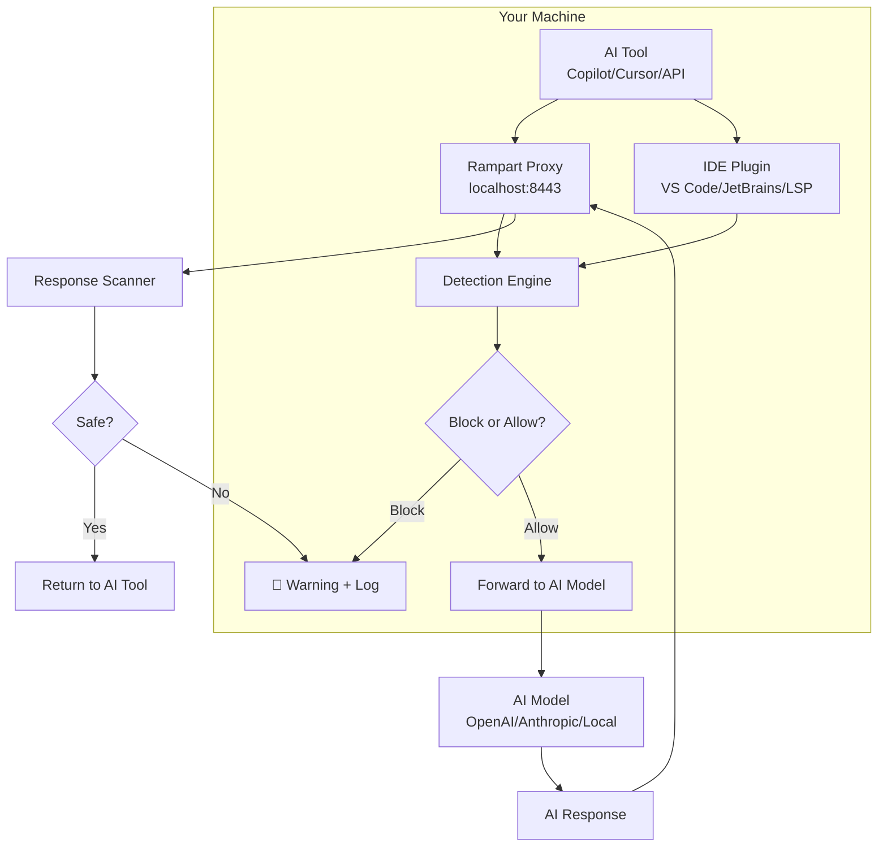

> **⚡ AegisGate Rampart v0.6.0 is LIVE** — Local proxy, MITM block mode, CA key encryption, audit log redaction, IDE plugins for VS Code/Cursor and JetBrains. [Download from GitHub](https://github.com/aegisgatesecurity/aegisgate-rampart/releases/tag/v0.6.0) (free, open source, Apache 2.0).

<!-- Source of truth: https://github.com/aegisgatesecurity/aegisgate-rampart -->

<div class="alert alert-info">
<strong>⚡ AegisGate Rampart v0.6.0</strong> &mdash; <em>canonical facts (source: <a href="https://github.com/aegisgatesecurity/aegisgate-rampart">aegisgate-rampart repo</a>)</em>

<ul>
<li><strong>Local proxy</strong>: Intercepts AI traffic transparently at the system level — no app changes needed</li>
<li><strong>IDE integration</strong>: VS Code/Cursor extension, JetBrains plugin, generic LSP server (Neovim, Emacs, Helix, Sublime)</li>
<li><strong>MITM block mode</strong>: Blocks malicious prompts before they reach the AI model</li>
<li><strong>CA key encryption</strong>: Encrypted at rest with passphrase — no plaintext keys on disk</li>
<li><strong>Audit log redaction</strong>: PII and secrets stripped from logs before writing</li>
<li><strong>1,318 test functions</strong>, 80.7% coverage</li>
<li><strong>13 release assets</strong>: macOS (Intel + ARM), Linux (deb + rpm), Windows, Docker (multi-arch, signed)</li>
<li><strong>Apache 2.0</strong>, zero external dependencies for core functionality</li>
</ul>
</div>

<div class="alert alert-success alert-center">
<strong>⚡ AegisGate Rampart</strong> is <strong>free and open source</strong>. No account required. No cloud calls. All detection happens locally on your machine. <a href="https://github.com/aegisgatesecurity/aegisgate-rampart/releases/tag/v0.6.0" target="_blank" rel="noopener noreferrer" class="btn btn-primary" style="margin-left:12px">Download Rampart v0.6.0 →</a>
</div>

---

## What is Rampart?

Rampart is a **local security proxy** that sits between your AI tools and the AI models they talk to. It works in two ways:

### 1. Local Proxy Mode

Rampart runs as a transparent proxy on your machine. Any AI tool that makes HTTP requests — Copilot, Cursor, local LLMs like Ollama, API calls to OpenAI/Anthropic — gets intercepted and scanned.

**How it works:**

```
Your AI tool (Copilot/Cursor/API) → Rampart proxy (localhost:8443) → AI model (OpenAI/Anthropic/local)
```

- Rampart generates a local CA certificate and configures your system to trust it
- All HTTPS traffic to AI services flows through the proxy
- Requests and responses are scanned in real-time
- Malicious content is blocked before it reaches the model (or before the response reaches you)
- CA keys are encrypted at rest with a passphrase — no plaintext keys on disk

### 2. IDE Plugin Mode

Rampart runs inside your editor, providing real-time detection as you type:

| Editor | Plugin | Status |
|--------|--------|--------|
| **VS Code / Cursor** | [aegisgate-rampart-ext](https://github.com/aegisgatesecurity/aegisgate-rampart-ext) | v0.3.0, published |
| **JetBrains (IntelliJ, PyCharm, etc.)** | [aegisgate-rampart-jetbrains](https://github.com/aegisgatesecurity/aegisgate-rampart-jetbrains) | v0.3.0, published |
| **Neovim / Emacs / Helix / Sublime** | Rampart-LSP (generic LSP server) | Available via `rampart-lsp` binary |

The LSP server uses JSON-RPC 2.0 over stdio — it works with any editor that supports LSP.

---

## What Rampart Detects

Rampart uses the same detection engine as AegisGate Lens and Platform:

| Category | What it catches |
|----------|-----------------|
| **PII** | SSN, email, phone, passport, credit card, bank routing, addresses |
| **Secrets** | API keys, AWS keys, GitHub tokens, database passwords, SSH keys, JWTs |
| **XSS** | Script injection, event handlers, encoded payloads, SVG vectors |
| **Compliance** | HIPAA, GDPR, PCI-DSS, EU AI Act text violations |
| **Adversarial ML** | Prompt injection, jailbreak attempts, model extraction, data exfiltration — 100/100 patterns caught |
| **Response scanning** | PII leakage in AI responses, hallucinated secrets, injected content |

---

## Quick Start

### Option 1: Install the IDE plugin

**VS Code / Cursor:**
1. Open Extensions panel
2. Search for "AegisGate Rampart"
3. Install and reload

**JetBrains:**
1. Open Settings → Plugins → Marketplace
2. Search for "AegisGate Rampart"
3. Install and restart

**Neovim / any LSP editor:**
```bash
# Download rampart-lsp binary
curl -L https://github.com/aegisgatesecurity/aegisgate-rampart/releases/latest/download/rampart-lsp-linux-amd64 -o /usr/local/bin/rampart-lsp
chmod +x /usr/local/bin/rampart-lsp

# Add to your LSP config (Neovim example)
# lspconfig.rampart_lsp.setup({})
```

### Option 2: Run as a local proxy

```bash
# Download for your platform
curl -L https://github.com/aegisgatesecurity/aegisgate-rampart/releases/latest/download/aegisgate-rampart-linux-amd64 -o aegisgate-rampart
chmod +x aegisgate-rampart

# Start the proxy
./aegisgate-rampart --port=8443 --upstream=https://api.openai.com

# Point your AI tool at the proxy
# Instead of: https://api.openai.com/v1/chat/completions
# Use:        http://localhost:8443/v1/chat/completions
```

### Option 3: Docker

```bash
docker run -d \
  -p 8443:8443 \
  -p 9090:9090 \
  ghcr.io/aegisgatesecurity/aegisgate-rampart:v0.6.0
```

---

## Rampart vs Lens vs Platform

| Feature | Lens (browser) | Rampart (local proxy/IDE) | Platform (server) |
|---------|:-:|:-:|:-:|
| **Protects browser AI chat** | ✅ | — | — |
| **Protects IDE AI tools** | — | ✅ | — |
| **Protects API calls** | — | ✅ | ✅ |
| **Protects server-to-server AI** | — | — | ✅ |
| **Real-time editor detection** | — | ✅ | — |
| **Compliance frameworks** | 5 facets | 5 facets | 31 frameworks |
| **SIEM/SOAR integration** | — | — | ✅ |
| **Multi-tenant** | — | — | ✅ |
| **Air-gapped deployment** | — | — | ✅ |
| **Price** | Free | Free | Free tier + paid |

**Typical setup:**
- **Individual**: Install Lens (browser) + Rampart (IDE) → full local protection
- **Developer team**: Rampart (IDE) for each dev + Platform (server) for centralized policy
- **Enterprise**: Platform (server) + Lens (browser) for non-technical staff + Rampart (IDE) for developers

---

## Privacy & Security

Rampart is designed with the same privacy principles as all AegisGate products:

1. **Zero data collection** — no telemetry, no analytics, no phone-home
2. **All detection is local** — patterns and ML model run on your machine
3. **CA keys encrypted at rest** — passphrase-protected, never plaintext
4. **Audit log redaction** — PII and secrets stripped from logs before writing to disk
5. **No network egress** — Rampart never sends your data anywhere
6. **Open source** — Apache 2.0, auditable, no hidden behavior

---

## Download

### Release Assets (v0.6.0)

| Platform | Asset | Architecture |
|----------|-------|-------------|
| macOS | `aegisgate-rampart-darwin-amd64.tar.gz` | Intel |
| macOS | `aegisgate-rampart-darwin-arm64.tar.gz` | Apple Silicon |
| Linux | `aegisgate-rampart-linux-amd64.tar.gz` | x86_64 |
| Linux | `aegisgate-rampart-linux-arm64.tar.gz` | ARM64 |
| Linux | `aegisgate-rampart-linux-amd64.deb` | Debian/Ubuntu |
| Linux | `aegisgate-rampart-linux-amd64.rpm` | RHEL/Fedora |
| Windows | `aegisgate-rampart-windows-amd64.zip` | x86_64 |
| Docker | `ghcr.io/aegisgatesecurity/aegisgate-rampart:v0.6.0` | Multi-arch (cosign-signed) |

<p>
<a href="https://github.com/aegisgatesecurity/aegisgate-rampart/releases/tag/v0.6.0" target="_blank" rel="noopener noreferrer" class="btn btn-primary">All 13 assets on GitHub →</a>
<a href="https://github.com/aegisgatesecurity/aegisgate-rampart" target="_blank" rel="noopener noreferrer" class="btn btn-secondary">Source code →</a>
</p>

---

## IDE Integration Details

For detailed setup instructions for each editor, see our [IDE Integration Guide](/docs/ide-integration/).

<details>
<summary><strong>VS Code / Cursor setup</strong></summary>

1. Install the [AegisGate Rampart extension](https://github.com/aegisgatesecurity/aegisgate-rampart-ext) from the VS Code marketplace
2. The extension automatically starts the Rampart LSP server
3. Detection results appear as inline diagnostics (like lint warnings)
4. Configure severity levels in `.vscode/settings.json`:

```json
{
  "rampart.detection.severity": "warning",
  "rampart.detection.categories": ["pii", "secrets", "xss", "compliance", "ml"]
}
```
</details>

<details>
<summary><strong>JetBrains setup</strong></summary>

1. Open Settings → Plugins → Marketplace
2. Search "AegisGate Rampart" → Install → Restart
3. Detection results appear in the Problems tool window
4. Configure in Settings → Tools → AegisGate Rampart
</details>

<details>
<summary><strong>Neovim setup (any LSP editor)</strong></summary>

```lua
-- Neovim (init.lua with nvim-lspconfig)
require'lspconfig'.rampart_lsp.setup{
  cmd = {"/path/to/rampart-lsp"},
  filetypes = {"*"}, -- scan all file types
  settings = {
    detection = {
      categories = {"pii", "secrets", "xss", "compliance", "ml"},
      severity = "warning"
    }
  }
}
```
</details>

---

## Architecture



---

## Frequently Asked Questions

<details>
<summary><strong>Does Rampart slow down my AI tools?</strong></summary>

No. Detection adds ~5ms latency, which is imperceptible compared to the seconds-long response times of AI models. The ML model runs in pure Go — no external process, no network calls.
</details>

<details>
<summary><strong>Does Rampart store my prompts?</strong></summary>

No. Rampart processes prompts in memory and discards them. Audit logs are written with PII and secrets redacted — only the detection category and severity are recorded.
</details>

<details>
<summary><strong>Can I use Rampart without the proxy?</strong></summary>

Yes. The IDE plugin mode (LSP) works without the proxy. You can also use just the proxy without the IDE plugin. They're independent.
</details>

<details>
<summary><strong>How is Rampart different from Lens?</strong></summary>

Lens is a browser extension that watches what you type into AI chat websites. Rampart is a system-level proxy and IDE plugin that catches AI traffic from any application — Copilot, Cursor, API calls, local LLMs. They use the same detection engine but protect different surfaces.
</details>

<details>
<summary><strong>Is Rampart free for commercial use?</strong></summary>

Yes. Apache 2.0 license. Free for personal and commercial use. No restrictions, no attribution required beyond the license terms.
</details>